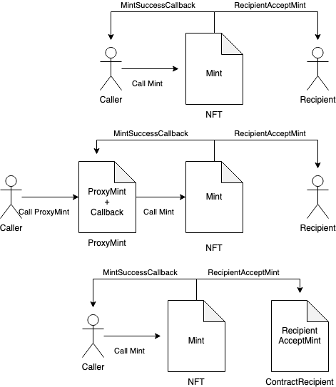

---
tags:
  - contract
  - call
  - another
  - callback
  - msgs
---

# Messages, Callbacks & Contract-to-Contract Interaction

## Contract-to-Contract Interaction

Developers may wish to call another contract to perform a specific action.

### Crosschain calling example using Messages

Let's assume we have a button contract. The button contract allows addresses to interact and press the button. In this example we write a contract that interacts with the button contract called ```CallerContract```

Firstly, we need the name of the transition and shape of the parameters we are trying to call. In our case the transition name is ```PressTheButton``` with no arguments.

```ocaml
contract Example()

transition PressTheButton()
end

```

### Messages

Our contract so far defines a transition called ProxyPressButton, that takes a ByStr20 as an argument. When this transition is called, a Message call object is created called ```button_contract_call```. A call object takes three manditory arguments called ```_tag```, ```_recipient``` and ```_amount```. These relate to the transition name, contract address and ZIL amount in QA respectively.

In our case the _tag will be ```PressTheButton```, the_recipient will be the variable we pass ```button_contract_address``` and the _amount we are sending is ```Uint128 0```.

When the button contract recieves the transition call from the proxy it can inspect the address using```_sender```, this will be populated with the proxys address. The contract also has access to the caller who initited the chain from the proxy using ```_origin```.

```ocaml {12,13,14}
contract Proxy()

let one_msg = 
  fun (msg : Message) => 
  let nil_msg = Nil {Message} in
    Cons {Message} msg nil_msg
...
contract CallerContract()
...
transition ProxyPressButton(button_contract_address: ByStr20)
    button_contract_call = {
        _tag: "PressTheButton";
        _recipient: button_contract_address;
        _amount: Uint128 0;
    };
    msgs = one_msg button_contract_call;
    send msgs
end
```

### Calling a contract with parameters

In the case where we are calling a contract with some parameters, have extra values on the call object that relate to the vname of the transition

```ocaml {3}
contract Example()

transition ExampleWithParams(int_value: Uint256, bystr_value: ByStr20)
end
```

```ocaml {10,11}
contract Proxy()

transition ProxyPressButton(example_contract_address: ByStr20)
    i_value = Uint256 44;
    b_value = example_contract_address
    example_contract_call = {
        _tag: "ExampleWithParams";
        _recipient: example_contract_address;
        _amount: Uint128 0;
        int_value: i_value;
        bystr_value: b_value;
    };
    msgs = one_msg example_contract_call;
    send msgs
end
```

### Calling mutiple contracts with one call

We can send mutiple contract calls by chaining mutiple Message types together, creating a Constructor for the Message type and rolling the values ```msg1``` and ```msg2``` into ```two_msgs```.

In the below example, the Mint transition is calling ```RecipientAcceptMint``` on the recipient address and it is calling back to the sender of the transaction with a callback ```MintSuccessCallBack```.

:::note
Proxy contracts need to implement the callback for functions to callback to.

This will error on transaction processing if it's not defined.
:::

```ocaml
contract Proxy()

let two_msgs =
fun (msg1 : Message) =>
fun (msg2 : Message) =>
  let msgs_tmp = one_msg msg2 in
  Cons {Message} msg1 msgs_tmp
...
contract CallerContract()
...
transition Mint(recipient: ByStr20, amount: Uint128)
  ...
  msg_to_recipient = {_tag : "RecipientAcceptMint"; _recipient : recipient; _amount : uint128_zero; 
                      minter : _sender; recipient : recipient; amount : amount};
  msg_to_sender = {_tag : "MintSuccessCallBack"; _recipient : _sender; _amount : uint128_zero; 
                      minter : _sender; recipient : recipient; amount : amount};
  msgs = two_msgs msg_to_recipient msg_to_sender;
  send msgs
end
```

## Callbacks

It's typical to provide Callbacks when transitions execute successfully so the proxy callers can update their interactive contracts if possible.

Take the below example where ```Mint``` creates two messages ```msg_to_recipient``` and ```msg_to_sender```. The manditory tags ```_tag```, ```_recipient``` and ```_amount``` are aligned seperately for easier reading.

```msg_to_recipient``` calls the transition ```RecipientAcceptMint``` for the ```recipient``` with ```uint128_zero``` QA.

```msg_to_sender``` calls the transition ```MintSuccessCallBack``` for the ```_sender``` with ```uint128_zero``` QA.

```ocaml
  msg_to_recipient = {_tag : "RecipientAcceptMint"; _recipient : recipient; _amount : uint128_zero; 
                      minter : _sender; recipient : recipient; amount : amount};
  msg_to_sender = {_tag : "MintSuccessCallBack"; _recipient : _sender; _amount : uint128_zero; 
                      minter : _sender; recipient : recipient; amount : amount};
```

Take the below diagram of the way these messages could be sent.

Note that there are many ways to call this function and depending on what your chain of execution looks like, you may need to implement one or both messages in your contract.

User wallets do not need to implement any messages, but any contracts where the ```_recipient``` is the address do.

The second example shows the typical proxy interface where a user calls a proxy, which then calls some logical contract to do some work. When the example calls back to it's ```_recipient``` it's looking at ```_sender``` not ```_origin``` therefore the proxy will need to implement the ```MintSuccessCallback``` stub since it's the sender.

The third example shows the case where a contract is the recipient of a Mint. The consuming contract will have to implement the ```RecipientAcceptMint``` stub

:::note
You will recieve a transaction error if your contract does not implement a callback stub as the chain of execution fails to find the _tag name on your contract.
:::



## Further Reading
