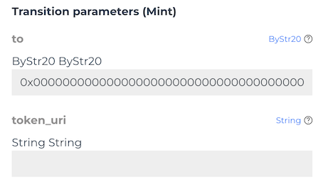
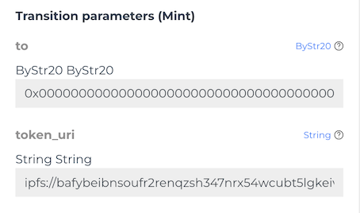
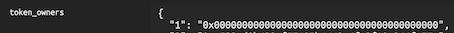

# Minting a token

With the metadata available and a decision made on if the project is using ```token_uris``` or ```base_uri``` we can begin the final step, minting a token.

## base_uri

As discussed previously, the base_uri mode offloads the handling of images and metadata to the API and as such, the minter does not have to provide a token URI as that is calculated by base_uri/token_id, it can send an empty string and have the metadata still resolve for a token. If a token URI is provided here, then the base_uri is overridden to show the token URI for this particular token.

The below example shows base_uri being used for token 1, 2 and potentially 3 - but a token URI has also been provided for token 3 in token_uris. In this case token 3 has its metadata permanently found at the location in token_uris rather than the base_uri. The token URI can only be assigned at mint-time and then becomes immutable, but the base_uri can be changed at anytime.

```json
"base_uri": "ipfs://QmZILCdt3yb6mZitzWBmQr65AW6Wska295Dg9nbS0M3UrI/",
"token_uris": {
  "3": "ipfs://QmZILw65yBXgyfG2ZBg5TrfB2hPjrDQH3RCQFJGkARStAE"
}
```

```base_uri``` is suited best to randomised minting projects which do not want to expose potential data directly on the chain. This can have other implications regarding failed transactions inadvertently revealing the data.



Another advantage of base_uri is that since no ```token_uri``` needs to be provided, you can BatchMint several tokens whilst not providing a token_uri.

## token_uri

If you are not providing a base_uri, every token is expected to have a ```token_uris``` row where the metadata can be found for that token.

The state of the contract will look like the below example.

```json
"base_uri": "",
"token_uris": {
  "1": "ipfs://QmZILCdt3yb6mZitzWBmQr65AW6Wska295Dg9nbS0M3UrI/1",
  "2": "ipfs://QmZILCdt3yb6mZitzWBmQr65AW6Wska295Dg9nbS0M3UrI/2",
  "3": "ipfs://QmZILCdt3yb6mZitzWBmQr65AW6Wska295Dg9nbS0M3UrI/3",
  "4": "ipfs://QmZILCdt3yb6mZitzWBmQr65AW6Wska295Dg9nbS0M3UrI/4",
  "5": "ipfs://QmZILCdt3yb6mZitzWBmQr65AW6Wska295Dg9nbS0M3UrI/5"
}
```



```token_uris``` is best suited to non-randomised projects. Since the data resides on the chain a failed transaction will reveal the ```token_uri``` so this is best used when the data is not required to be private and won't change in the future. If ```base_uri``` is empty, then ecosystem partners will attempt to take a value from```token_uris``` instead.

## Contract state

After you've minted a test NFT, check the contract state and receipt to ensure the token mint was a success.



## Royalty

Royalty defaults on deploy to 10%. Contract owners can call SetRoyaltyFeeBPS with a basis points value to set a new royalty amount. The royalty recipient address defaults to the contract owner on deploy. Contract owners can call SetRoyaltyRecipient with a new royalty recipient to change the value of where royalties should be sent.

When a trade is executed on a compliant ZRC-6 marketplace, they will respect the royalty you've set and send a percentage of the overall trade value to the royalty recipient. Ecosystem partners will need to develop this logic to read the royalty recipient and value in order to calculate how much funds should be sent and to whom.

## Summary

We've covered the whole process of deploying an NFT project to a network. Using the IDE to call the Mint transition to perform some initial minting tests. We discussed the difference between base_uri and token_uri and how the ZRC-7 metadata should be the JSON response for all URI's, rather than the resource itself.

We shouldn't edit or extend the NFT standard contract further. Indexers will be keying into the contract immutable, mutable and transition names - if you change these values then these potentially may break resulting in your NFT contract not being identified by ecosystem partners. Ecosystem partners will not want to write an edgecase for every project which wants to differ from the standard. Rather, create a new contract which contains the other onchain logic you need and have these two contract interact in the way you require.

When we want to decorate extra attributes that fall outside of ZRC-7, they will work for your user specific application if you choose to program against these, but ecosystem partners will only be able to read these values. As such, the data from the URI must be returned in the standardised way.

In the interactivity section, we take a step further to creating some tools that abstract us further from the IDE and closer to a full Javascript implementation.
